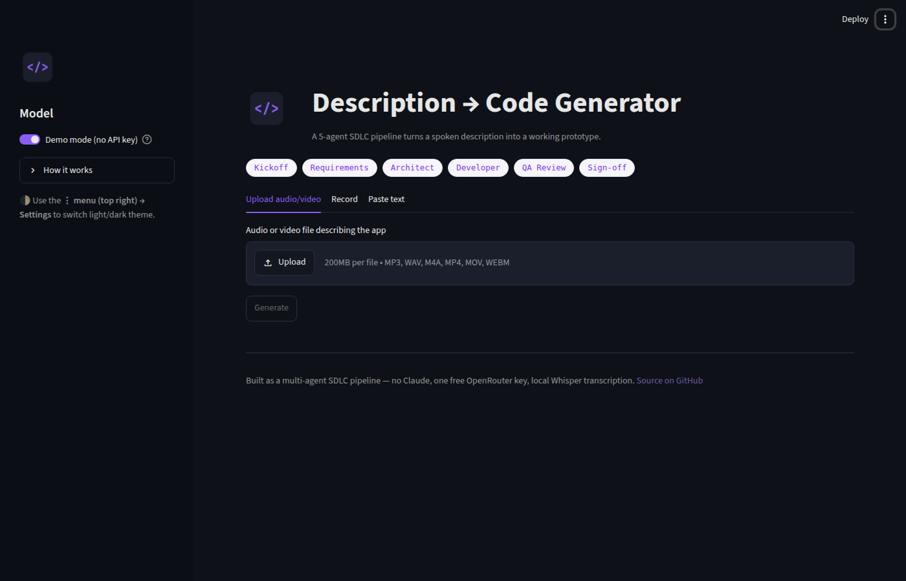
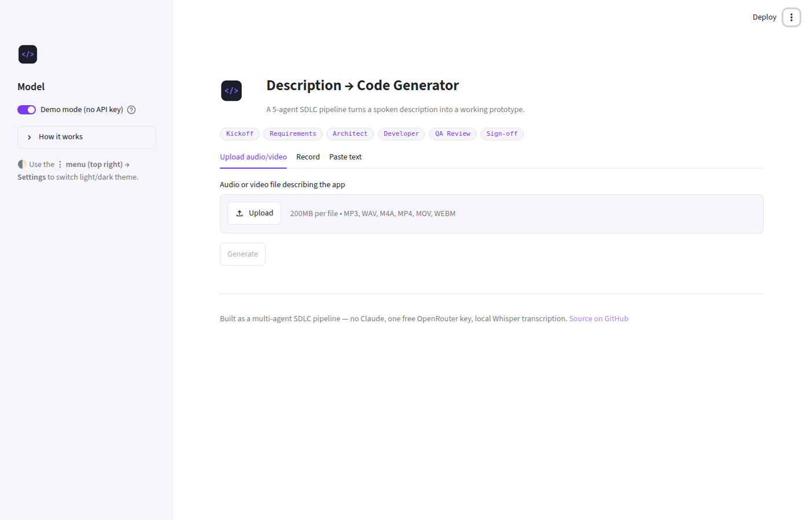
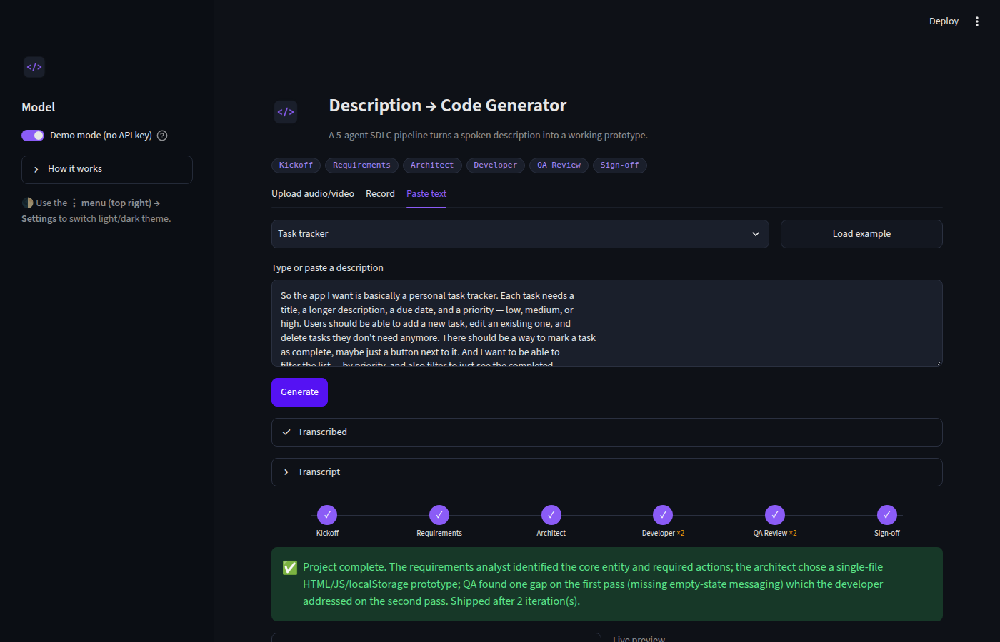

# Description → Code Generator

   

Turn a spoken audio/video description of an app into a working prototype,
using a small team of AI agents that mirror a real software development
lifecycle — a Project Manager, a Requirements Analyst, an Architect, a
Developer, a QA Reviewer, and a Tester. When the app's concept implies user
accounts, the Developer adds a small registration/login flow and the
Tester tries it with a synthetic user (for HTML output, in a real headless
browser) before the result ships — see "Accounts and testing" below.

<p>
  
  
</p>
<p>
  
</p>

Light and dark are Streamlit's own native theme switcher (top-right "⋮"
menu → Settings) — every visitor gets both, no code needed on their end.

## How it works

```
recording (upload or microphone)
        │
        ▼
 GroqWhisperTranscriber   (Groq's hosted Whisper API — needs one
        │                  GROQ_API_KEY set by whoever deploys the app;
        │                  files over ~19.5MB are rejected before upload)
        ▼
 Project Manager  ──kickoff brief──▶
 Requirements Analyst ──requirements.json──▶
 Architect ──architecture.json (chosen language + has_auth)──▶
 Developer ──source code──▶
 QA Reviewer ──pass/fail + issues──▶
 Tester ──pass/fail + notes (real browser run for HTML+accounts, else LLM review)──▶
        ▼
 (loop back to Developer once if QA or Testing found something — max 2 passes)
        ▼
 Project Manager writes a final summary
        ▼
 a single self-contained, working prototype file
 (no build step, no external requests, no third-party dependencies)
```

`Orchestrator` runs up to `max_qa_iterations` (default **2**) build →
review → test passes: the Developer gets one chance to fix whatever QA or
Testing found on the first pass, then whatever's produced ships either
way — not an unbounded retry loop. (An earlier version of this app
defaulted to a single pass with no retry at all, after several rounds of
rate-limit/timeout/truncation pain on a longer description or a slower
free model — see `docs/PROCESS.md`. The default went back to 2 to give
the accounts feature below a real chance to get fixed if Testing catches
something, while staying a small, explicit cap rather than an open-ended
loop.) If you don't like the result, **Regenerate** gives you a fresh
attempt any time.

The Architect picks the language per app rather than defaulting to one —
a form-driven CRUD app is usually best as one self-contained HTML file
(`localStorage` persistence, opens directly in a browser); a
data-processing or automation-style tool is usually better as one
self-contained Python script. Either way the Developer writes exactly one
file, matching whatever the Architect decided.

### Accounts and testing

The Architect also decides whether an app's concept genuinely implies user
accounts (`has_auth`) — most rapid prototypes don't (a calculator, a
single shared list), some do (a personal tracker, a multi-user tool). When
it does:

- **HTML output** stores accounts in `localStorage` under their own key
  (separate from the app's main data) — a small embedded "database" that
  survives a reload, not an in-memory value that resets. The Developer is
  given a fixed contract of element ids (`pipeline/auth_contract.py`) for
  the registration/login form and a status element, so the flow is both
  usable and — critically — testable by something other than an LLM's
  opinion of its own code.
- **Python output** stores accounts in a small local SQLite file via the
  standard-library `sqlite3` module — no new dependency, still one
  self-contained script, but the accounts survive a restart.
- The **Tester** stage then actually exercises this: for HTML output,
  `pipeline/browser_tester.py` loads the generated file in a real headless
  Chromium, registers a synthetic user, reloads the page (proving the
  `localStorage` persistence, not just in-page state), and checks that a
  wrong password is rejected and the correct one succeeds. For any other
  language, or wherever a real browser isn't available, `TesterAgent`
  falls back to an LLM reasoning through the same scenario — there's no
  safe way to execute arbitrary generated code for other languages here.
  Either way you get a `TestReport` per iteration in the UI ("Testing
  history"), and it's flagged `executed=True`/`False` so you can tell a
  real result from an LLM's guess.
- Playwright is a **dev/test-only** dependency (`requirements-dev.txt`),
  not part of the deployed app's `requirements.txt`. A bare Streamlit
  Community Cloud deployment has no browser binary available, so its
  Testing stage will show "skipped" for HTML apps too rather than a real
  pass/fail, until/unless a browser is set up there separately (not done
  by this project — see `docs/PROCESS.md`).

Every one of the six agents is a thin wrapper around one `LLMProvider`
interface (`pipeline/llm.py`) — they never know which model is actually
answering them. Both `app.py` and `cli.py` default to **`OpenRouterProvider`**
(default model: `inclusionai/ling-3.0-flash-vl:free` — see `docs/PROCESS.md`
for the full back-and-forth on picking a model/provider, including a round
trip through `AIHubMixProvider` and back). `AIHubMixProvider` is still
fully implemented and tested — both talk to an OpenAI-chat-completions-shaped
API, so they share one request/error-handling implementation and differ
only in URL, key source, and default model; switching `app.py` to it is a
one-line change if OpenRouter's shared-key rate limit becomes a problem
again. **No Claude is used anywhere in this app** — that was a
deliberate choice to run on free models. Because each provider is one
gateway, **a single API key powers every agent** for whichever one is
active; there is no per-agent or per-stage key. The app owner sets this key
once (an environment variable or Streamlit Cloud secret) — visitors don't
need their own, and there's no sidebar key/model input for them to fill in.
Swapping in a different backend (Claude, Gemini, a local Ollama model) or
model id later means writing one more class or changing one constant, not
rewriting the app.

Transcription is a separate, independent concern (`pipeline/transcribe.py`):
audio/video files are transcribed via **Groq's hosted Whisper API**. An
earlier version ran `faster-whisper` entirely on-device, but that broke on
Streamlit Community Cloud (a missing system OpenMP library, plus an
unreliable first-use model download on the free tier — see
`docs/PROCESS.md`), so it was replaced with one hosted API call instead.
The app owner sets one free `GROQ_API_KEY` (console.groq.com/keys) as a
Streamlit Cloud secret or environment variable; visitors don't need their
own. Uploads/recordings over ~19.5MB are rejected before ever reaching
Groq's API, since that's the point it stops accepting files in practice.

## Running it locally

```bash
pip install -r requirements.txt
export OPENROUTER_API_KEY=sk-...  # free key from openrouter.ai/keys, powers the 5-agent pipeline
export GROQ_API_KEY=gsk_...       # free key from console.groq.com/keys, needed only for audio/video transcription
streamlit run app.py
```

Both keys are read once at startup (from these env vars, or from
`.streamlit/secrets.toml` when running under Streamlit) — there's nothing
to enter in the app itself, and no sidebar. Without either key set,
Generate shows a clear "not configured" error instead of running or
failing silently.

Record or upload a description, click **Generate**, and watch the step
tracker. After a run, **Regenerate** re-runs the pipeline on the same
transcript (useful to see a different draft against a live model), and
**Start over** clears everything back to the input screen.

### Command line (no Streamlit)

```bash
python cli.py run examples/sample_transcript.txt --out examples/output --mock
# or, with a real key:
OPENROUTER_API_KEY=sk-... python cli.py run my_recording.mp3 --out output
```

### Getting API keys

- **OpenRouter** (powers both `app.py` and `cli.py`): sign up at
  [openrouter.ai](https://openrouter.ai) (no card required), create a key
  at [openrouter.ai/keys](https://openrouter.ai/keys), and check
  [openrouter.ai/models](https://openrouter.ai/models) (filter by "Free")
  for current free-tier options — `DEFAULT_MODEL` in `pipeline/llm.py` is
  one constant to change.
- **AIHubMix** (an alternate provider, implemented and tested as
  `AIHubMixProvider` but not the app's default right now): sign up at
  [aihubmix.com](https://aihubmix.com) and create a key from their
  dashboard if you want to switch to it — see `docs/PROCESS.md` for why
  this project tried it and reverted.

## Deploying it for free (Streamlit Community Cloud)

This repo is deploy-ready for [share.streamlit.io](https://share.streamlit.io),
which runs a Streamlit app straight from a public GitHub repo at no cost:

1. Push this repo to GitHub (already done if you're reading this on GitHub).
2. Go to [share.streamlit.io](https://share.streamlit.io) and sign in with
   GitHub.
3. Click **New app**, pick this repository and branch, and set the main
   file path to `app.py`.
4. Click **Deploy**. `requirements.txt` is picked up automatically.
5. Under the app's **Settings → Secrets**, add:
   ```toml
   OPENROUTER_API_KEY = "sk-..."
   GROQ_API_KEY = "gsk_..."
   ```
   (free at [openrouter.ai/keys](https://openrouter.ai/keys) and
   [console.groq.com/keys](https://console.groq.com/keys)). Both are the
   *deployer's* keys, set once, shared by every visitor — nobody pastes in
   their own key or picks a model; Generate shows a clear "not configured"
   error if either key is missing.

Since both keys are shared across every visitor rather than one each,
watch OpenRouter's/Groq's rate limits under real traffic — a busy app can
hit them faster than a per-visitor-key design would. `AIHubMixProvider` is
implemented and tested as an alternate provider if OpenRouter's limit
becomes a real problem — see `docs/PROCESS.md` for the round trip this
project already made through it and back.

### Making the deployed app look polished (a few manual, one-time steps)

Everything below is either already done in this repo or a dashboard click
only the repo/deploy owner can make — nothing here needs code:

1. **Custom app URL** — in Streamlit Cloud, *App settings → General*, set a
   clean slug (e.g. `description-to-code.streamlit.app`) instead of the
   random default.
2. **GitHub social preview** — repo *Settings → General → Social preview*,
   upload [`assets/social_preview.png`](assets/social_preview.png) (already
   generated, 1280×640) so shared links look good on Slack/Twitter/etc.
3. **Repo description & topics** — same *Settings* page: add a one-line
   description and topics like `ai`, `streamlit`, `multi-agent`, `llm` for
   discoverability.
4. **Rebrand later, if you want**: colors live entirely in
   [`.streamlit/config.toml`](.streamlit/config.toml) (edit the hex values —
   both `[theme.light]` and `[theme.dark]` need to stay defined together, or
   Streamlit removes the light/dark switcher entirely) and the mark itself
   is [`assets/logo.png`](assets/logo.png) (swap the file, same filename).
5. **Dark/light mode** — nothing to configure; it's Streamlit's native "⋮"
   menu → Settings, already on by construction (see previous point).

## Security notes

- No provider ever logs or serializes a raw key. `OpenRouterProvider` wraps
  its key in a small `Secrets` class (`pipeline/secrets.py`) whose
  `__repr__`/`__str__` never expose the raw value; `AIHubMixProvider` and
  `GroqWhisperTranscriber` take the key as a plain string but only ever
  print a masked form (`pipeline/secrets.py`'s `mask_key` — first/last 4
  chars and length) to the server log, and only on an auth failure, to help
  diagnose a wrong/stale key without exposing it. No key is ever written
  into the prompt log, the generated prototype, or an error message shown
  in the browser. `OPENROUTER_API_KEY`, `GROQ_API_KEY`, and (if you switch
  to it) `AIHUBMIX_API_KEY` all live only in Streamlit secrets/environment
  variables, set by the deployer — never in a widget a visitor's browser
  can read back.
- Every agent only ever holds a reference to the `LLMProvider` interface,
  never to a raw key or `Secrets` itself, so a bug in a prompt can't leak
  one.
- The Developer/QA prompts require safe handling of untrusted input
  regardless of which language the Architect picks: `textContent` instead
  of string-built `innerHTML` for HTML output, and no string-concatenated
  shell commands or SQL queries for any other language.

## Limitations

- Each generated prototype manages one primary entity (the thing the
  recording is mostly about — tasks, contacts, recipes, etc.) with
  create/edit/delete/complete/filter-style actions, as a single
  self-contained source file. This is a rapid-prototyping tool, not a full
  application compiler — multi-entity apps, real backends, multi-file
  projects, and authentication are out of scope by design.
- The Architect chooses the output language per app; there's no way to
  force a specific one from the UI (the deployer can steer this by editing
  the Architect's prompt in `pipeline/agents.py`). Only the generated
  HTML gets a live in-app preview — other languages show as syntax-
  highlighted source, not an executed result, since there's no safe way to
  run arbitrary generated code inside the app itself.
- Free-tier model quality and rate limits vary and change over time, and
  since one `OPENROUTER_API_KEY` is shared across every visitor, a busy
  deployment can hit rate limits faster than a per-visitor-key design
  would; if a run fails, try again shortly, point `DEFAULT_MODEL` at a
  different model, or switch `app.py` to `AIHubMixProvider`.
- Audio/video input needs a `GROQ_API_KEY` configured by the deployer,
  outbound internet access to Groq, and a file no larger than ~19.5MB
  (Groq's real cutoff in practice, tighter than its documented 25MB) — the
  app rejects anything bigger before ever calling the API.
- Neither `OpenRouterProvider` nor `AIHubMixProvider` sends a `max_tokens`/
  output cap of its own — deliberate, per the deployer. If a model's reply
  still gets cut off (`finish_reason: "length"`, meaning the model or
  provider hit *its own* limit), that raises a clear error naming how many
  tokens the model actually produced, rather than silently handing a
  truncated file to QA. The Developer stage is most exposed to this since
  it writes the
  largest output of any agent; a model that doesn't converge on a single,
  complete file will keep hitting this regardless of any cap, ours or its
  own.

## Project layout

```
pipeline/
  secrets.py       Secrets — encapsulates the API key
  llm.py           LLMProvider (ABC), OpenRouterProvider (default), AIHubMixProvider, MockLLMProvider
  transcribe.py    Transcriber (ABC), GroqWhisperTranscriber, PassthroughTranscriber
  schema.py        ProjectBrief, Requirements, ArchitectureDoc (incl. language/has_auth), QAReport, TestReport, PipelineResult
  agents.py        Agent (ABC) + the 6 SDLC personas (incl. TesterAgent)
  auth_contract.py the register/login element-id contract shared by DeveloperAgent's prompt and browser_tester.py
  browser_tester.py real headless-browser auth test for HTML output (dev/test dependency, degrades gracefully)
  orchestrator.py  Orchestrator — runs the pipeline incl. the QA+Testing/Dev loop
app.py             Streamlit UI (hero, step tracker, results, buttons) — no sidebar
cli.py             headless runner
.streamlit/config.toml   theme (light + dark) + maxUploadSize
assets/            logo.png (page icon + in-app mark), social_preview.png
examples/          sample transcripts (used by cli.py/tests) + committed mock-mode output
tests/             pytest suite (runs entirely against MockLLMProvider; browser-executed
                   auth tests skip cleanly where no real Chromium binary is available)
requirements-dev.txt  dev/test-only deps (pytest, playwright) — not part of the deployed app
docs/PROCESS.md    the brainstorming / prompt-iteration write-up
docs/screenshots/  README screenshots
```

See [`docs/PROCESS.md`](docs/PROCESS.md) for the design process, the AI
tools used, and the prompt iterations behind each agent.
